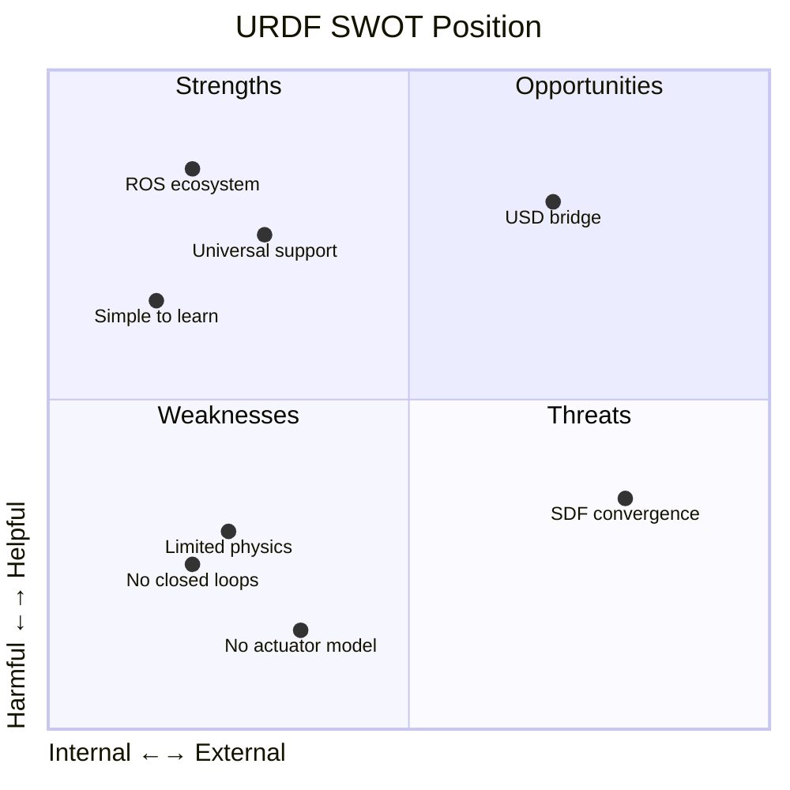
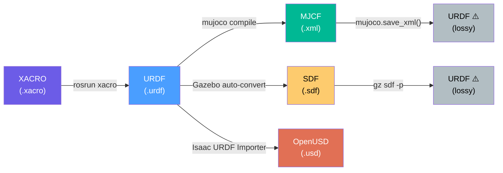
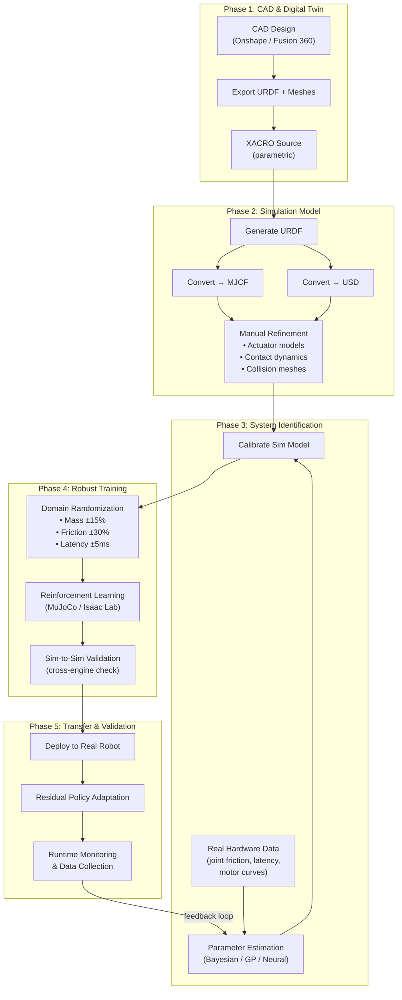

# Robot Simulation Description Formats: A Comprehensive Analysis


## 1. Format Overview

| Property | **URDF** | **XACRO** | **MJCF** | **SDF (SDFormat)** | **OpenUSD** |
| :--- | :--- | :--- | :--- | :--- | :--- |
| **Full Name** | Unified Robot Description Format | XML Macros | MuJoCo XML Format | Simulation Description Format | Universal Scene Description |
| **Origin** | ROS / Willow Garage | ROS community | DeepMind / MuJoCo | Open Source Robotics Foundation | Pixar / NVIDIA |
| **File Extension** | `.urdf` | `.xacro` | `.xml` | `.sdf` / `.world` | `.usd` / `.usda` / `.usdc` |
| **Encoding** | XML | XML + macros | XML | XML | Binary or ASCII |
| **Topology** | Strict tree (no loops) | Strict tree (compiles to URDF) | Free graph (loops OK) | Free graph (loops OK) | Scene graph (DAG) |
| **Primary Focus** | Kinematics + basic dynamics | Modular URDF authoring | Physics simulation | World + robot simulation | Full scene composition |
| **Open Standard** | ✅ (REP 120) | ✅ (ROS tool) | ✅ (Apache 2.0) | ✅ (versioned spec) | ✅ (ASWF / Pixar) |

---

## 2. SWOT Analysis

### 2.1 URDF — Unified Robot Description Format



| | Analysis |
|---|---|
| **Strengths** | • **Universal ROS support** — every ROS tool (RViz, MoveIt, Nav2, TF) speaks URDF natively. • **Simplicity** — easy to write by hand, well documented, huge community. • **Portability** — any simulator can ingest URDF (MuJoCo, PyBullet, Gazebo, Isaac Sim, Drake). • **Mature CAD tooling** — exporters exist for SolidWorks, Fusion 360, and Onshape. |
| **Weaknesses** | • **Tree-only topology** — cannot represent parallel linkages or closed-loop chains (e.g., delta robots, Stewart platforms). • **No actuator/sensor model** — actuator dynamics, transmission ratios, and sensors must be added externally. • **No environment support** — describes only the robot, not the world. • **Verbose XML** — large robots produce thousands of lines of boilerplate. |
| **Opportunities** | • **Bridge to OpenUSD** — Isaac Sim's URDF Importer makes URDF the on-ramp to USD-based simulation. • **AI-assisted generation** — LLMs can parse/generate URDF from natural language or CAD metadata. • **Community inertia** — the largest library of open-source robot models is in URDF. |
| **Threats** | • **SDF/MJCF supersede it** — formats with richer physics are gaining market share. • **Legacy baggage** — maintaining `<gazebo>` extension tags creates fragile, tool-specific files. • **No active spec evolution** — the format has been largely frozen for years. |

---

### 2.2 XACRO — XML Macros

| | Analysis |
|---|---|
| **Strengths** | • **DRY principle** — macros, variables, and file inclusion eliminate copy-paste for symmetric limbs/wheels. • **Parametric robots** — change a single variable (e.g., `arm_length`) and the entire model updates. • **Conditional logic** — `<xacro:if>` enables one file to describe multiple robot variants. • **Native ROS integration** — standard part of the ROS build pipeline. |
| **Weaknesses** | • **Not a simulation format** — it is a preprocessor; the output is always a plain URDF. • **Debugging is painful** — macro expansion errors produce cryptic messages pointing to generated XML, not the source. • **Inherits all URDF limitations** — no closed loops, no actuators, no world description. • **ROS-only tooling** — requires `xacro` command or `rosrun` to compile. |
| **Opportunities** | • **Template libraries** — community-shared xacro "component libraries" (wheels, grippers, sensors) accelerate new robot design. • **CI/CD integration** — xacro → URDF → MJCF → validate can be fully automated. |
| **Threats** | • **Competing macro systems** — MJCF's `<default>` classes and USD's composition arcs offer similar DRY benefits natively. • **Reduced relevance** — if the industry moves away from URDF, xacro loses its raison d'être. |

---

### 2.3 MJCF — MuJoCo XML Format

| | Analysis |
|---|---|
| **Strengths** | • **Physics-first design** — native support for contact dynamics (`solref`, `solimp`), tendons, equality constraints, actuator models (`position`, `velocity`, `motor`, `cylinder`). • **Closed-loop kinematics** — supports equality constraints to form parallel linkages. • **`<default>` class system** — hierarchical defaults eliminate boilerplate (like xacro, but built-in). • **Compact format** — a full humanoid with actuators fits in ~200 lines. • **Performance-tuned** — the parser directly builds MuJoCo's internal `mjModel` struct. |
| **Weaknesses** | • **MuJoCo-centric** — not natively understood by ROS tools, Gazebo, or Isaac Sim. • **Learning curve** — the contact model, solver parameters, and body-centric (vs. joint-centric) tree require study. • **No world composition** — while you can define scenes, there's no layering/referencing system like USD. • **Mesh handling** — requires convex decomposition for collision; no native NURBS support. |
| **Opportunities** | • **Explosive growth** — MuJoCo went open-source (2022), MJX/Warp added GPU/TPU acceleration, Newton unifies the stack. • **RL dominance** — MJCF is the lingua franca for locomotion and manipulation RL research. • **Conversion tools improving** — MuJoCo's built-in URDF→MJCF compiler keeps getting better. |
| **Threats** | • **USD/SDF ecosystem pressure** — industrial users may bypass MJCF entirely via Isaac Sim's USD pipeline. • **Fragmented tooling** — no equivalent of MoveIt or Nav2 for motion planning in the MuJoCo ecosystem. |

---

### 2.4 SDF (SDFormat) — for context

| | Analysis |
|---|---|
| **Strengths** | • **Full world description** — lights, sensors, terrain (heightmaps), actors, physics properties, all in one file. • **Strictly versioned spec** — prevents ambiguity across tool versions. • **Closed-loop support** — no tree-only limitation. • **Gazebo native** — the primary format for the most widely used open-source simulator. |
| **Weaknesses** | • **Gazebo-centric** — limited adoption outside the Gazebo/Ignition ecosystem. • **ROS friction** — URDF is still required for `robot_state_publisher`, TF, and MoveIt; SDF can't replace it directly. • **Declining mindshare** — as the industry shifts to MuJoCo (RL) and Isaac Sim (industrial), SDF's niche narrows. |
| **Opportunities** | • **Gazebo Harmonic** — the latest Gazebo release modernizes SDF support with ROS 2 integration. • **Hybrid workflows** — URDF augmented with `<gazebo>` tags auto-converts to SDF internally. |
| **Threats** | • **OpenUSD** — NVIDIA's push to make USD the universal interchange format directly challenges SDF's "world description" role. • **MuJoCo Warp / Newton** — high-performance alternatives reducing Gazebo's relevance for RL research. |

---

### 2.5 OpenUSD — Universal Scene Description

| | Analysis |
|---|---|
| **Strengths** | • **Industry-standard scene format** — backed by Pixar, Apple, NVIDIA, and the ASWF. • **Composition & layering** — override physics, visuals, or sensors on separate layers without touching the base asset. • **Scalable collaboration** — multiple engineers can work on different layers of the same robot simultaneously. • **Photorealistic rendering** — native support for RTX materials, ray tracing, and PBR shaders. • **Isaac Lab native** — the primary format for NVIDIA's robot learning framework. |
| **Weaknesses** | • **Heavyweight** — requires significant tooling (Omniverse, Isaac Sim) to work with; not pip-installable. • **NVIDIA ecosystem lock-in** — primary robotics support comes through Isaac Sim (requires NVIDIA GPU). • **Not robot-specific** — USD is a general scene format; robotics semantics (joints, actuators) are added via PhysX schemas. • **Learning curve** — prims, variants, composition arcs, and schemas are concepts from VFX, not robotics. |
| **Opportunities** | • **Digital twin standard** — USD is converging as the format for factory/warehouse-scale simulation. • **Newton integration** — the next-gen physics engine builds on USD + Warp. • **AI training at scale** — NVIDIA's Omniverse Replicator uses USD for synthetic data generation. |
| **Threats** | • **Open-source alternatives** — if MuJoCo/MJCF tooling becomes rich enough, researchers may not need USD. • **Fragmentation risk** — multiple USD "profiles" (robotics, VFX, AEC) could diverge. |

---

## 3. Platform Compatibility Matrix

| Simulator / Tool | URDF | XACRO | MJCF | SDF | OpenUSD |
| :--- | :---: | :---: | :---: | :---: | :---: |
| **MuJoCo** | ✅ import | ⚠️ compile first | ✅ native | ❌ | ❌ |
| **MJX / MuJoCo Warp** | ✅ via MuJoCo | ⚠️ compile first | ✅ native | ❌ | ❌ |
| **Gazebo (Classic)** | ✅ + `<gazebo>` tags | ✅ via rosrun | ❌ | ✅ native | ❌ |
| **Gazebo (Harmonic)** | ✅ + `<gazebo>` tags | ✅ via rosrun | ❌ | ✅ native | ❌ |
| **Isaac Sim** | ✅ via importer | ⚠️ compile first | ❌ | ❌ | ✅ native |
| **Isaac Lab** | ✅ via importer | ⚠️ compile first | ✅ (via mjlab) | ❌ | ✅ native |
| **PyBullet** | ✅ native | ⚠️ compile first | ✅ partial | ✅ partial | ❌ |
| **Drake** | ✅ native | ⚠️ compile first | ✅ partial | ✅ partial | ❌ |
| **Newton** | ❌ | ❌ | ✅ (via Warp) | ❌ | ✅ native |
| **ROS 2 (RViz, TF, MoveIt)** | ✅ native | ✅ native | ❌ | ⚠️ limited | ❌ |
| **Unreal (URLab)** | ❌ | ❌ | ✅ native | ❌ | ✅ partial |
| **MATLAB / Simulink** | ✅ native | ⚠️ compile first | ❌ | ❌ | ❌ |
| **Onshape** | ✅ export | ❌ | ❌ | ❌ | ❌ |
| **Fusion 360** | ✅ plugin | ❌ | ❌ | ❌ | ❌ |

> **Legend:** ✅ = full support | ⚠️ = requires preprocessing or partial support | ❌ = not supported

---

## 4. Format Conversion: What You Gain and Lose

### 4.1 Conversion Path Map



### 4.2 Information Loss Matrix

| Conversion | Lossless? | What is **Preserved** | What is **Lost / Requires Manual Work** |
| :--- | :---: | :--- | :--- |
| **XACRO → URDF** | ✅ Yes | Everything — it's a macro expansion | Macro structure, variables, conditionals (flattened) |
| **URDF → MJCF** | ⚠️ Partial | Link hierarchy, joint types, mass, inertia, visual/collision meshes | Actuator definitions, sensor configs, transmission ratios, `<gazebo>` plugin tags, self-collision exclusion pairs, material colours (may default) |
| **URDF → SDF** | ⚠️ Partial | Core kinematics, basic dynamics | Fine-grained contact parameters, custom ROS plugin configs |
| **URDF → OpenUSD** | ⚠️ Partial | Geometry, joint hierarchy, mass/inertia | Actuator dynamics (must recreate as USD PhysX drives), sensor definitions, material PBR properties |
| **MJCF → URDF** | ❌ Lossy | Basic tree-structure joints and links | Tendon definitions, equality constraints, closed-loop joints, actuator models (motor/cylinder/muscle), default classes, solver parameters, contact pairs, custom sites |
| **SDF → URDF** | ❌ Lossy | Robot tree structure | World elements, closed-loop joints, plugin definitions, heightmaps, actors |
| **MJCF → USD** | ❌ No direct path | Must go MJCF → URDF → USD (double lossy) | Nearly all physics tuning is lost |

> [!WARNING]
> **The golden rule:** Conversions are essentially **one-way funnels**. URDF → MJCF is a common one-time bootstrap step, but after conversion you should **maintain and iterate exclusively in the target format**. Round-tripping is not practical.

---

## 5. The CAD Robot Engineer's Time Budget

Where does a CAD engineer building a robot from scratch spend most of their time?

### 5.1 Typical Time Allocation

> **Time Distribution: CAD → Sim-Ready Robot**
 
 ```mermaid
-pie title "Time Distribution: CAD → Sim-Ready Robot"
+pie showData
     "Mechanical CAD Design" : 25
     "Geometry Cleanup & Defeaturing" : 20
-    "Inertial & Mass Properties" : 10
+    "Link Physics (Mass/Inertia)" : 10
     "Joint/Actuator Definition" : 15
-    "Collision Mesh Preparation" : 15
+    "Collision Mesh Prep" : 15
     "Simulation Tuning & Validation" : 10
-    "Documentation & Format Conversion" : 5
+    "Format Conversion" : 5
 ```

### 5.2 Detailed Breakdown

| Phase | % Time | Pain Points |
| :--- | :---: | :--- |
| **1. Mechanical CAD Design** | ~25% | Creative work — link geometry, housing, mounting. Uses SolidWorks / Fusion 360 / Onshape. |
| **2. Geometry Cleanup ("Defeaturing")** | ~20% | **The hidden time sink.** CAD models contain chamfers, fillets, bolt holes, and internal cavities that are irrelevant to simulation but break mesh generators. Engineers must manually simplify models to produce clean convex hulls. |
| **3. Inertial & Mass Properties** | ~10% | CAD tools auto-compute inertia tensors, but these must be verified and sometimes manually overridden (e.g., for hollow links, cable routing mass, motor rotors). |
| **4. Joint & Actuator Definition** | ~15% | Mapping CAD mates to URDF/MJCF joints. Defining axis directions, limits, damping, friction, gear ratios, and motor curves. This is almost entirely manual. |
| **5. Collision Mesh Preparation** | ~15% | Generating simplified collision primitives or running convex decomposition (V-HACD, CoACD). Overly detailed collision meshes slow simulation; overly simple ones cause penetration. |
| **6. Simulation Tuning & Validation** | ~10% | Loading the model in MuJoCo/Gazebo/Isaac, verifying it holds pose under gravity, checking joint limits, tuning contact parameters, and comparing against real hardware data. |
| **7. Format Conversion & Documentation** | ~5% | Running xacro→URDF→MJCF pipelines, fixing conversion artifacts, documenting the model. |

> [!IMPORTANT]
> **The biggest non-obvious cost is Phase 2 (Defeaturing) + Phase 5 (Collision Meshes) = ~35% of total effort.** This is pure "format tax" — work that exists solely because simulation engines need simplified geometry that CAD tools don't produce natively.

---

## 6. Popular CAD Environments for Robotics

### 6.1 Traditional CAD Software

| Software | Provider | Paradigm | Strengths for Robotics |
| :--- | :--- | :--- | :--- |
| **FreeCAD** | Open Source | Parametric | Highly extensible via Python. Completely free and open-source, ideal for hobbyists and academic projects with zero licensing headaches. |
| **Onshape** | PTC | Cloud-Native Parametric | "Google Docs for CAD." Excellent for collaborative robot design. Native ROS/URDF exporter plugins are highly robust, making it arguably the smoothest CAD-to-URDF path today. |
| **Fusion 360** | Autodesk | Parametric + Direct | Massive maker/startup adoption. Very fluid interface with good community plugins for URDF export (e.g., `fusion2urdf`). |

### 6.2 Polygon/Mesh-based Environments

| Software | Environment Paradigm | Strengths for Robotics |
| :--- | :--- | :--- |
| **Blender** | 3D Modeling & Animation | Excellent for complex, non-parametric shapes and artistic rendering. With tools like **LinkForge** (see below), it's emerging as a native environment for composing robot kinematics directly in a 3D workspace. |
| **Unity** | Game Engine | Superb real-time rendering and extensive physics/AI plugins (e.g., Unity Robotics Hub). Often used for synthetic data generation and testing sensor perception pipelines. |

### 6.3 LinkForge (Blender Plugin Review)

[**LinkForge**](https://github.com/arounamounchili/linkforge) is a "Modular Bridge & Linter for Robotics" that turns Blender into a first-class citizen for the robotics simulation pipeline.

* **What it solves:** Instead of wrestling with verbose XML or battling finicky export scripts from traditional CAD, LinkForge lets you build the robot's kinematic tree, assign mass properties, and set up ROS 2 control interfaces directly within Blender's 3D viewport.
* **Key Features:**
    * **Bidirectional Workflow:** Import existing URDFs/XACROs, edit them visually, and re-export without data loss.
    * **Built-in Linter:** Actively checks for physics-breaking errors like negative inertias, disconnected links, or malformed kinematics *before* exporting.
    * **ros2_control Support:** Can generate the hardware interface boilerplate automatically for Gazebo and real hardware.
    * **Automatic Physics:** Computes mass and inertia tensors dynamically from the mesh features.
* **Why it matters:** It drastically reduces the "Format Tax" (the 35% of time normally spent fixing meshes and manual URDF typing) by making robot composition a visual, drag-and-drop experience while strictly enforcing simulation compliance. It acts as a strict safety net to guarantee the output is rigorous, simulation-ready code.

---

## 7. The Ideal Sim2Real Pipeline

### 7.1 End-to-End Architecture



### 7.2 Pipeline Stages in Detail

#### Phase 1: CAD & Digital Twin
- **Tool choice matters:** Use a CAD tool with URDF export capability (Onshape has the best web-based workflow; Fusion 360 has community plugins).
- **Design for simulation:** Avoid overly complex geometry from the start. Use modular assemblies that map 1:1 to desired URDF links.
- **Manage your meshes:** Export visual meshes as `.obj` or `.dae` (for appearance) and collision meshes as simplified `.stl` (for physics).

#### Phase 2: Simulation Model Creation
- Build your **parametric XACRO** with variables for dimensions, mass, and joint limits.
- Compile to URDF, then run a **one-time conversion** to your target format:
  - **MJCF** for MuJoCo-based RL research
  - **USD** for Isaac Sim / Isaac Lab industrial pipelines
- **Never go back** — maintain and iterate in the target format from this point forward.
- Manually define: actuator models, contact parameters, sensor attachments, and self-collision exclusion pairs.

#### Phase 3: System Identification (The Accuracy Lever)

> [!TIP]
> **This is where sim2real accuracy is won or lost.** The single most impactful thing you can do is calibrate your simulation model against real hardware data.

- Measure **real joint friction curves** (static + Coulomb + viscous).
- Characterise **actuator latency** (command-to-torque delay, typically 1–10ms).
- Record **motor torque-speed curves** at multiple operating points.
- Use tools like the [MuJoCo System Identification (sysid) package](https://github.com/google-deepmind/mujoco/blob/main/python/mujoco/sysid/README.md), **Bayesian optimisation**, or **Gaussian Processes** to fit simulation parameters to match real trajectories.
- Validate: drop the real robot from the same initial configuration and compare the simulated vs. real trajectory.

#### Phase 4: Robust Training
- **Domain Randomisation** — randomise the parameters you identified in Phase 3 within measured uncertainty bounds:
  - Mass: ±10–20%
  - Friction coefficients: ±20–40%
  - Actuator gains: ±10–15%
  - Observation noise: match sensor datasheets
  - Control latency: ±2–5ms
- **Sim-to-Sim validation** — run the same policy in MuJoCo AND a second engine (e.g., Isaac Sim, Drake). If behaviour diverges, the policy is likely overfitting to simulator-specific artefacts.
- **Curriculum learning** — start with easy tasks and progress to harder ones.

#### Phase 5: Transfer & Validation
- Deploy to real hardware using **impedance/torque control** (not position control) for compliant behaviour.
- Use **residual policy learning** — a small real-world fine-tuning network on top of the sim-trained base policy.
- Collect failure data and feed it back into Phase 3 (system identification) to continuously close the reality gap.

### 7.3 Sim2Real Accuracy Checklist

| Factor | Typical Impact on Reality Gap | How to Address |
| :--- | :---: | :--- |
| Joint friction modelling | 🔴 High | Measure real friction curves; use viscous + Coulomb model |
| Actuator latency | 🔴 High | Measure command-to-torque delay; add to sim |
| Contact dynamics | 🔴 High | Calibrate `solref`/`solimp` (MuJoCo) or PhysX contact params |
| Mass/inertia accuracy | 🟡 Medium | Verify CAD-computed values; weigh real parts |
| Observation noise | 🟡 Medium | Match sensor datasheets; add realistic noise in sim |
| Visual domain gap | 🟡 Medium | Domain randomisation on textures, lighting, camera pose |
| Mesh fidelity | 🟢 Low | Simplified convex hulls are usually sufficient |
| Gravity / environmental | 🟢 Low | Standard; rarely a significant source of error |

---

## 8. Recommendations

### For the Researcher (RL / Learning)
> Use **XACRO → URDF → MJCF** as your primary pipeline. Maintain your model in MJCF. Use MuJoCo/MJX/Warp for training; validate in a second engine before real-world deployment.

### For the Industrial Engineer (Digital Twin)
> Use **CAD → URDF → OpenUSD** via Isaac Sim's importer. Leverage USD layering for collaborative sim model development. Use Isaac Lab for GPU-accelerated training.

### For the Hybrid Team
> Maintain a single **XACRO** source of truth. Generate both MJCF and USD from the same URDF. Accept that each target format will need manual enrichment. Automate the xacro → URDF step in CI/CD.

---

## References

- MuJoCo Documentation: [mujoco.readthedocs.io](https://mujoco.readthedocs.io)
- ROS URDF Spec: [wiki.ros.org/urdf](https://wiki.ros.org/urdf)
- SDFormat Specification: [sdformat.org](http://sdformat.org)
- OpenUSD: [openusd.org](https://openusd.org)
- NVIDIA Isaac Sim URDF Import: [docs.isaacsim.omniverse.nvidia.com](https://docs.isaacsim.omniverse.nvidia.com)
- Tobin et al. (2017): *Domain Randomisation for Transferring Deep Neural Networks from Simulation to the Real World*, IROS.
- Ramos et al. (2019): *BayesSim: Adaptive Domain Randomisation via Probabilistic Inference*, RSS.
- MuJoCo System Identification: [github.com/google-deepmind/mujoco/sysid](https://github.com/google-deepmind/mujoco/blob/main/python/mujoco/sysid/README.md)
