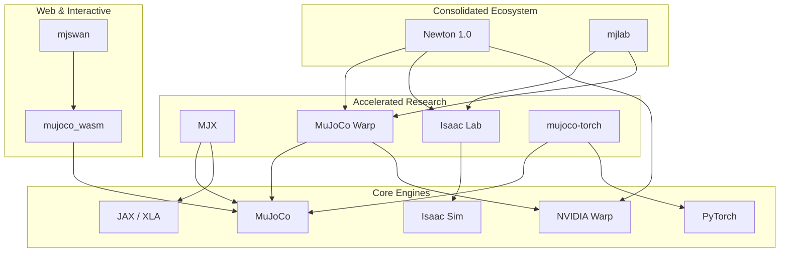

# Robotic Simulation Benchmarks & Ecosystem

This repository serves as a comprehensive guide and benchmarking suite for modern robotic simulation software. It covers everything from high-fidelity industrial simulators to lightning-fast research engines and web-based interactive demonstrations.

## 🚀 Core Simulation Engines

### [Isaac Sim & Isaac Lab](COMPARISONS.md)
NVIDIA's flagship simulation platform. Isaac Sim is built on Omniverse and OpenUSD, focusing on photorealistic rendering and massive GPU parallelism. **Isaac Lab** is the unified learning framework built on top of it, optimized for reinforcement learning.
- **Strength:** Massive parallelism (4,000+ envs), photorealistic RTX rendering, and seamless NVIDIA robotics stack integration.
- **Best for:** Vision-based policies, large-scale RL, and industrial digital twins.

### [MuJoCo & MJX](COMPARISONS.md)
**MuJoCo** (Multi-Joint dynamics with Contact) is the academic gold standard for physics accuracy. **MJX** (MuJoCo XLA) is a JAX-based reimplementation that allows MuJoCo to run in parallel on GPUs and TPUs.
- **Strength:** Unmatched linear stability, fast CPU performance, and massive throughput on TPU.
- **Best for:** Academic research, multi-joint articulated systems, and fast algorithmic prototyping.

### [Newton (NVIDIA + DeepMind + Disney)](NEWTON.md)
The next-generation open-source physics engine (announced at GTC 2025/2026). Newton unifies the accuracy of MuJoCo with the GPU-native acceleration of NVIDIA Warp.
- **Key Tech:** Uses **Signed Distance Fields (SDF)** for pixel-perfect collisions and **Hydroelastic Contact** for realistic distributed pressure modeling.
- **Performance:** Up to **252x locomotion** and **475x manipulation** speedups vs MJX on Blackwell GPUs.

---

## 💻 Platform-Specific Performance

### [MuJoCo on Apple Silicon](MACMJX.md)
A specialized deep-dive into running MJX on macOS. While Metal GPU acceleration via XLA is currently limited, Apple Silicon CPUs provide exceptional price/performance.
- **M4 Max Performance:** Achieves **114,841 steps/second** (574x realtime) for humanoid models.
- **Best Value:** Mac Mini M2/M4 offers the best price-per-kstep for budget-conscious researchers.

---

## 🌐 Web & Interactive Ecosystem

Recent advancements have allowed high-fidelity physics to run directly in the browser, enabling "Simulation-as-a-Website."

### [mjswan](https://github.com/ttktjmt/mjswan)
A robust framework for creating interactive MuJoCo simulations. It enables real-time policy control directly in the web browser.
- **Tech Stack:** Utilizes `mujoco_wasm`, ONNX Runtime, and `three.js`.
- **Use Case:** Sharing AI robot demonstrations as static websites (e.g., via GitHub Pages).

### [mjlab](https://github.com/mujocolab/mjlab)
An implementation of the **Isaac Lab API**, but powered by **MuJoCo-Warp**.
- **Use Case:** Provides a bridge for researchers who want the familiar Isaac Lab API and workflow but prefer the underlying physics properties (or licensing/portability) of the MuJoCo/Warp ecosystem.

### [mujoco_wasm](https://github.com/zalo/mujoco_wasm)
A pioneering project by Jonathon Selstad (`zalo`) that first brought MuJoCo to the web via **WebAssembly (WASM)**.
- **Tech Stack:** Emscripten-based compilation of the MuJoCo C library for browser execution.
- **Impact:** Served as the foundation for the community-led effort to make physics-based robotics accessible without native installs.

### [MuJoCo Warp](https://github.com/google-deepmind/mujoco_warp)
A collaborative project between **Google DeepMind** and **NVIDIA** that brings MuJoCo's physics to NVIDIA's **Warp** framework.
- **Strength:** High-throughput GPU acceleration using sparse matrix operations and speculative execution.
- **Best for:** Massive-scale reinforcement learning (up to 475x faster than MJX for manipulation) and serving as the underlying solver for Newton.

### [mujoco-torch](https://github.com/vmoens/mujoco-torch)
A PyTorch-native integration for MuJoCo, developed by **Vincent Moens** (maintainer of TorchRL and TensorDict).
- **Strength:** Exposes MuJoCo's physical state and parameters directly as differentiable PyTorch tensors.
- **Best for:** Researchers building end-to-end differentiable simulation pipelines within the PyTorch and TorchRL ecosystems.

---

## 📊 Ecosystem Dependency Graph

The following chart visualizes how these projects relate to and depend on each other.

---

## 📊 Quick Selection Guide

| Criterion | [MuJoCo](COMPARISONS.md) | [Isaac Sim](COMPARISONS.md) | [Newton](NEWTON.md) |
| --- | --- | --- | --- |
| **Primary Backend** | CPU / TPU (MJX) | GPU (PhysX) | GPU (Warp) |
| **Physics Accuracy** | Best (Linear) | Good | Best (SDF/Hydro) |
| **Speed (RL)** | High (via MJX) | Extreme (GPU-native) | Extreme+ (Blackwell) |
| **Rendering** | Functional | Photorealistic (RTX) | High (USD support) |
| **Ease of Setup** | Seconds (`pip install`) | Minutes/Hours | Moderate |
| **Hardware** | Anything (incl. RPi) | NVIDIA GPU (8GB+ VRAM) | NVIDIA GPU (Blackwell+) |

