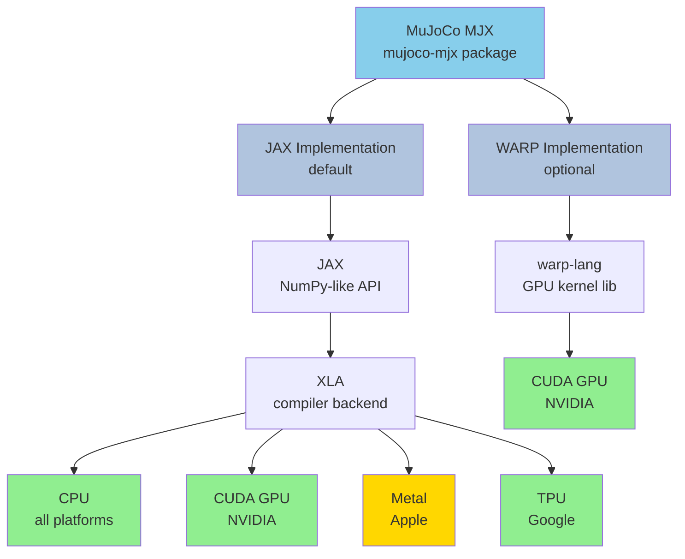
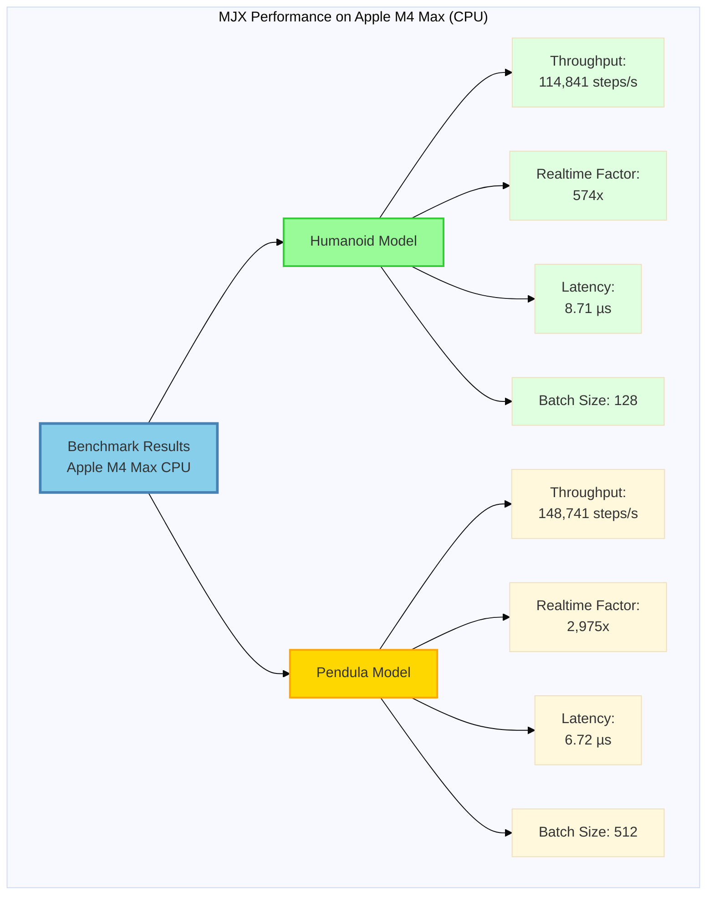
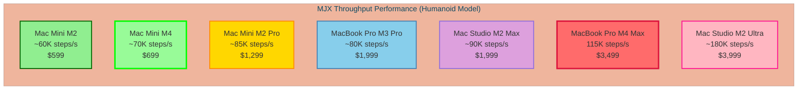

# Robotic Simulator Performance Benchmarks

A comprehensive benchmarking suite for evaluating the performance of various physics-based robotic simulators. This repository provides standardized tests and metrics to compare simulation speed, accuracy, and resource utilization across different simulation platforms.

## Simulators Benchmarked

### Currently Supported

- **[Isaac Sim](https://developer.nvidia.com/isaac-sim)** - NVIDIA's high-fidelity robotics simulation platform with GPU acceleration and photorealistic rendering
- **[Isaac Lab](https://isaac-sim.github.io/IsaacLab/)** - Unified framework for robot learning built on Isaac Sim
- **[MuJoCo](https://mujoco.org/)** - Advanced physics engine designed for research and development in robotics and biomechanics
- **[MJX (MuJoCo XLA)](https://mujoco.readthedocs.io/en/stable/mjx.html)** - JAX-based reimplementation of MuJoCo for massive parallelization with GPU/TPU acceleration
  - 📁 [macOS Implementation & Benchmarks](mjx/macosx/) - Apple Silicon (M1/M2/M3/M4) benchmarking suite
  - 📊 [Architecture & Device Support](mjx/macosx/BENCHMARK.md) - Detailed technical documentation
- **[PyBullet](https://pybullet.org/)** - Python interface to the Bullet Physics SDK for robotics simulation and machine learning
- **[Gazebo](https://gazebosim.org/)** - Open-source 3D robotics simulator with robust physics engines

### Planned/Recommended

- **[Brax](https://github.com/google/brax)** - Google's differentiable physics engine in JAX, optimized for reinforcement learning
- **[Drake](https://drake.mit.edu/)** - MIT's C++ toolbox for analyzing dynamics of robots and planning
- **[Webots](https://cyberbotics.com/)** - Open-source robot simulator for education and research
- **[CoppeliaSim](https://www.coppeliarobotics.com/)** (formerly V-REP) - Cross-platform robot simulator with rich API
- **[DART](https://dartsim.github.io/)** - Dynamic Animation and Robotics Toolkit
- **[Chrono](https://projectchrono.org/)** - Multi-physics simulation engine

## Benchmark Categories

### Performance Metrics
- **Simulation Speed**: Real-time factor, steps per second
- **Parallelization**: Multi-core CPU and GPU utilization
- **Scalability**: Performance with increasing number of objects/robots
- **Memory Usage**: RAM and VRAM consumption

### Accuracy & Stability
- **Contact Resolution**: Collision detection and response fidelity
- **Integration Stability**: Numerical stability at various time steps
- **Physical Accuracy**: Comparison against real-world measurements

### Use Case Scenarios
- Single robot manipulation
- Multi-agent systems
- Reinforcement learning training (batched environments)
- Rigid body dynamics
- Soft body/deformable objects
- Complex contact scenarios

## Getting Started

```bash
# Clone the repository
git clone https://github.com/yourusername/sim-benchmarks.git
cd sim-benchmarks

# Install dependencies
pip install -r requirements.txt

# Run benchmarks
python run_benchmarks.py --simulator all
```

## Featured: MuJoCo MJX on Apple Silicon

### What is MJX?

**MuJoCo MJX** (MuJoCo XLA) is a high-performance reimplementation of the MuJoCo physics engine using JAX and XLA (Accelerated Linear Algebra). It enables:

- 🚀 **Massive Parallelization**: Run thousands of simulations simultaneously
- ⚡ **Hardware Acceleration**: GPU (CUDA/TPU) and CPU optimization via XLA
- 🔄 **Automatic Differentiation**: Built-in gradient computation for machine learning
- 🎯 **Batch Simulations**: Ideal for reinforcement learning and hyperparameter tuning

MJX maintains API compatibility with MuJoCo while providing orders of magnitude speedup for parallel workloads.

### macOS Apple Silicon Benchmarks

We've conducted comprehensive benchmarks of MJX on macOS with Apple Silicon, including the latest M4 Max chip.

#### Architecture Overview



**Legend:** 🟢 Full support | 🟡 Partial support | 🔵 MJX components

#### Test System: MacBook Pro 16" M4 Max

**Hardware Configuration:**
- **Chip**: Apple M4 Max
- **CPU**: 16 cores (12 Performance + 4 Efficiency)
- **Memory**: 36 GB unified
- **GPU**: 40-core (Metal - not supported by MJX)
- **Backend**: JAX CPU (Metal XLA has limitations)

#### Benchmark Results

##### Humanoid Model (128 parallel rollouts)

```
Configuration:
  - Model: humanoid/humanoid.xml
  - Batch size: 128 parallel rollouts
  - Steps: 100 per rollout (12,800 total steps)
  - Timestep: 0.005s
  - Solver: Conjugate Gradient (CG)

Performance:
  ✓ JIT compilation: 3.34s (one-time cost)
  ✓ Simulation time: 0.11s
  ✓ Throughput: 114,841 steps/second
  ✓ Realtime factor: 574.20x
  ✓ Per-step latency: 8.71 µs
```

##### Pendula Model (512 parallel rollouts)

```
Configuration:
  - Model: pendula.xml
  - Batch size: 512 parallel rollouts
  - Steps: 500 per rollout (256,000 total steps)
  - Timestep: 0.020s
  - Solver: Conjugate Gradient (CG)

Performance:
  ✓ JIT compilation: 4.62s (one-time cost)
  ✓ Simulation time: 1.72s
  ✓ Throughput: 148,741 steps/second
  ✓ Realtime factor: 2,974.83x
  ✓ Per-step latency: 6.72 µs
```

#### Performance Comparison Chart



#### Hardware Comparison & Price/Performance



#### Key Findings

🎯 **Performance Highlights:**
- **Humanoid**: 114,841 steps/second (574x realtime)
- **Pendula**: 148,741 steps/second (2,975x realtime)
- Excellent for parallel RL training on macOS

💰 **Best Value Options:**
- **Mac Mini M2/M4** ($599-799): ~60-70K steps/s - **Best price/performance**
- **Mac Mini M2 Pro** ($1,299): ~85K steps/s - Great for CI/CD
- **MacBook Pro M4 Max** ($3,499): 115K steps/s - Maximum single-machine performance

⚠️ **Current Limitation:**
- Metal GPU acceleration not supported (XLA limitation: `mhlo.reduce` operation)
- Benchmarks run on CPU only
- Future Metal XLA improvements may enable GPU acceleration

📚 **Detailed Documentation:**
- [macOS Setup & Usage Guide](mjx/macosx/README.md) - Complete setup instructions and hardware analysis
- [Technical Architecture & Benchmarks](mjx/macosx/BENCHMARK.md) - Device support matrix and performance deep-dive

## Repository Structure

```bash
# Clone the repository
git clone https://github.com/yourusername/sim-benchmarks.git
cd sim-benchmarks

# Install dependencies
pip install -r requirements.txt

# Run benchmarks
python run_benchmarks.py --simulator all
```

## Repository Structure

```
sim-benchmarks/
├── benchmarks/          # Individual benchmark scenarios
├── simulators/          # Simulator-specific implementations
├── results/             # Benchmark results and logs
├── analysis/            # Analysis scripts and visualization
├── configs/             # Configuration files
└── docs/                # Documentation
```

## Contributing

Contributions are welcome! Please see [CONTRIBUTING.md](CONTRIBUTING.md) for guidelines on:
- Adding new simulators
- Creating benchmark scenarios
- Reporting results
- Improving documentation

## Citation

If you use this benchmarking suite in your research, please cite:

```bibtex
@misc{sim-benchmarks,
  author = {Your Name},
  title = {Robotic Simulator Performance Benchmarks},
  year = {2026},
  publisher = {GitHub},
  url = {https://github.com/yourusername/sim-benchmarks}
}
```

## License

This project is licensed under the MIT License - see [LICENSE](LICENSE) file for details.

## Acknowledgments

- Simulator developers and communities
- Contributors to this benchmarking effort
- Research institutions supporting this work

## Contact

For questions or collaboration inquiries, please open an issue or contact [your-email@example.com].
