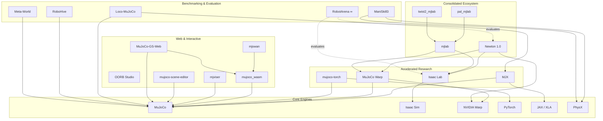

# Robotic Simulation Benchmarks & Ecosystem

This repository serves as a comprehensive guide and benchmarking suite for modern robotic simulation software. It covers everything from high-fidelity industrial simulators to lightning-fast research engines and web-based interactive demonstrations.

## 🚀 Core Simulation Engines

### [Isaac Sim & Isaac Lab](COMPARISONS.md)
NVIDIA's flagship simulation platform. Isaac Sim is built on Omniverse and OpenUSD, focusing on photorealistic rendering and massive GPU parallelism. **Isaac Lab** is the unified learning framework built on top of it, optimized for reinforcement learning.
- **Strength:** Massive parallelism (4,000+ envs), photorealistic RTX rendering, and seamless NVIDIA robotics stack integration.
- **Best for:** Vision-based policies, large-scale RL, and industrial digital twins.

### [MuJoCo & MJX](COMPARISONS.md)
**MuJoCo** (Multi-Joint dynamics with Contact) is the academic gold standard for physics accuracy. **MJX** (MuJoCo XLA) is a JAX-based reimplementation that allows MuJoCo to run in parallel on GPUs and TPUs.
- **Strength:** Unmatched linear stability, fast CPU performance, and massive throughput on TPU.
- **Best for:** Academic research, multi-joint articulated systems, and fast algorithmic prototyping.

### [Newton (NVIDIA + DeepMind + Disney)](NEWTON.md)
The next-generation open-source physics engine (announced at GTC 2025/2026). Newton unifies the accuracy of MuJoCo with the GPU-native acceleration of NVIDIA Warp.
- **Key Tech:** Uses **Signed Distance Fields (SDF)** for pixel-perfect collisions and **Hydroelastic Contact** for realistic distributed pressure modeling.
- **Performance:** Up to **252x locomotion** and **475x manipulation** speedups vs MJX on Blackwell GPUs.

---

## 💻 Platform-Specific Performance

### [MuJoCo on Apple Silicon](MACMJX.md)
A specialized deep-dive into running MJX on macOS. While Metal GPU acceleration via XLA is currently limited, Apple Silicon CPUs provide exceptional price/performance.
- **M4 Max Performance:** Achieves **114,841 steps/second** (574x realtime) for humanoid models.
- **Best Value:** Mac Mini M2/M4 offers the best price-per-kstep for budget-conscious researchers.

---

## 🌐 Web & Interactive Ecosystem

Recent advancements have allowed high-fidelity physics to run directly in the browser, enabling "Simulation-as-a-Website."

### [Robot Explorer](https://ferrolho.github.io/robot-explorer/)
An interactive 3D web application for visualizing and manipulating robot models directly in the browser.
- **Key Feature:** Allows real-time visualization of robot kinematics, manipulability ellipsoids, and joint controls.
- **Use Case:** Instantly visualizing and inspecting robot models without needing a local simulation environment.

### [OORB Studio](https://oorb.io/)
A cloud robotics workspace for building, testing, and iterating on ROS projects directly in the browser.
- **Key Feature:** Built-in collaboration and agentic tools for rapid robotic software development.
- **Use Case:** Remote web-based ROS development without local environment setup.

### [mjswan](https://github.com/ttktjmt/mjswan)
A robust framework for creating interactive MuJoCo simulations. It enables real-time policy control directly in the web browser.
- **Tech Stack:** Utilizes `mujoco_wasm`, ONNX Runtime, and `three.js`.
- **Use Case:** Sharing AI robot demonstrations as static websites (e.g., via GitHub Pages).

### [mjviser](https://github.com/mujocolab/mjviser)
A high-performance web-based MuJoCo viewer powered by **Viser**.
- **Tech Stack:** Python-native simulation with a [Viser](https://viser.studio) 3D backend for the browser.
- **Key Feature:** Provides the familiarity of the native MuJoCo viewer (sliders, contact/force viz, camera tracking) but accessible via a web URL.
- **Best for:** Remote visualization, cloud-based simulation environments, and interactive Python-driven MuJoCo experiments.

### [mujoco-scene-editor](https://github.com/markusgrotz/mujoco-scene-editor)
A lightweight, interactive scene editor for MuJoCo 3.x.
- **Key Feature:** Allows interactive placement of shapes, mesh imports, and robot additions directly in the browser with drag-and-drop gizmos.
- **AI Integration:** Includes `mjprompt` for generating entire MuJoCo MJCF scenes from natural language prompts.
- **Use Case:** Rapid prototyping of simulation environments and AI-assisted scene generation.

### [MuJoCo-GS-Web](https://vector-wangel.github.io/MuJoCo-GS-Web/)
A high-fidelity rendering bridge that integrates MuJoCo physics with **3D Gaussian Splatting (3DGS)**.
- **Key Feature:** Allows importing any robot (MJCF) into photorealistic 3DGS scenes with correct occlusion and interaction.
- **Control:** Supports end-effector teleop for models like Franka and XLeRobot, and runs pretrained RL policies.
- **Impact:** Enables "Simulation-as-a-Website" with photorealism that works on mobile devices thanks to pure WASM execution.

### [mjlab](https://github.com/mujocolab/mjlab)
An implementation of the **Isaac Lab API**, but powered by **MuJoCo-Warp**.
- **Use Case:** Provides a bridge for researchers who want the familiar Isaac Lab API and workflow but prefer the underlying physics properties (or licensing/portability) of the MuJoCo/Warp ecosystem.

#### [pal_mjlab](https://github.com/pal-robotics/pal_mjlab)
The official implementation of **PAL Robotics** models (TALOS, TIAGo, etc.) within the `mjlab` framework.
- **Use Case:** Sim-to-real reinforcement learning and motion imitation specifically for PAL Robotics hardware.

#### [twist2_mjlab](https://github.com/lzyang2000/twist2_mjlab)
A standalone MJLab task package for **Unitree G1** motion tracking based on the **TWIST2** dataset.
- **Use Case:** Enables reinforcement learning and motion tracking for humanoid robots using `mjwarp` by training from enriched PKL motion data.

### [mujoco_wasm](https://github.com/zalo/mujoco_wasm)
A pioneering project by Jonathon Selstad (`zalo`) that first brought MuJoCo to the web via **WebAssembly (WASM)**.
- **Tech Stack:** Emscripten-based compilation of the MuJoCo C library for browser execution.
- **Impact:** Served as the foundation for the community-led effort to make physics-based robotics accessible without native installs.

### [RoboHive](https://github.com/robonet-hub/robohive)
A unified ecosystem for robot learning that encompasses domains such as dexterous manipulation, legged locomotion, and musculoskeletal agents.
- **Key Feature:** High physics fidelity and rich visual diversity with a streamlined task interface for sim-to-real transfer.

### [Loco-MuJoCo](https://github.com/robfiras/loco-mujoco)
A specialized imitation learning benchmark for complex locomotion and whole-body control.
- **Key Feature:** Provides 22,000+ motion capture datasets (AMASS, LAFAN1) retargeted for 12 humanoid and 4 quadruped environments.

### [ManiSkill3](https://github.com/haosulab/ManiSkill)
A GPU-parallelized robotics simulation and rendering framework designed for **generalizable embodied AI**.
- **Key Feature:** Focuses on object-level generalizability of manipulation skills using 3D visual inputs.

## 🛠️ Performance Accelerators & Integrations

### [MuJoCo Warp](https://github.com/google-deepmind/mujoco_warp)
A collaborative project between **Google DeepMind** and **NVIDIA** that brings MuJoCo's physics into the NVIDIA **Warp** framework.
- **Strength:** High-throughput GPU acceleration using sparse matrix operations and speculative execution.
- **Best for:** Massive-scale reinforcement learning (up to 475x faster than MJX for manipulation).

### [mujoco-torch](https://github.com/vmoens/mujoco-torch)
A PyTorch-native integration for MuJoCo, developed by **Vincent Moens** (maintainer of TorchRL and TensorDict).
- **Strength:** Exposes MuJoCo's physical state and parameters directly as differentiable PyTorch tensors.
- **Best for:** Researchers building end-to-end differentiable simulation pipelines within the PyTorch ecosystem.

## 📊 Quick Selection Guide

| Criterion | [MuJoCo](COMPARISONS.md) | [Isaac Sim](COMPARISONS.md) | [Newton](NEWTON.md) |
| --- | --- | --- | --- |
| **Primary Backend** | CPU / TPU (MJX) | GPU (PhysX) | GPU (Warp) |
| **Physics Accuracy** | Best (Linear) | Good | Best (SDF/Hydro) |
| **Speed (RL)** | High (via MJX) | Extreme (GPU-native) | Extreme+ (Blackwell) |
| **Rendering** | Functional | Photorealistic (RTX) | High (USD support) |
| **Ease of Setup** | Seconds (`pip install`) | Minutes/Hours | Moderate |
| **Hardware** | Anything (incl. RPi) | NVIDIA GPU (8GB+ VRAM) | NVIDIA GPU (Blackwell+) |

---

## 🏆 Benchmarking & Evaluation Suites

While individual simulators provide environments, these projects provide standardized tasks and metrics to evaluate robot policy performance across diverse scenarios.

### [RobotArena ∞ (RobotArena Infinity)](https://robotarenainf.github.io/)
A high-fidelity benchmarking framework designed to evaluate **robot generalists** (VLA policies) trained on real-world data.
- **Key Feature:** Automatically converts real-world video demonstrations into simulated "digital twins" for rigorous, scalable assessment.

### [Meta-World](https://github.com/Farama-Foundation/Metaworld)
A widely used benchmark for evaluating multi-task and meta-reinforcement learning agents.
- **Key Feature:** Includes 50+ diverse robotic manipulation tasks on a Sawyer arm, requiring agents to master diverse skills simultaneously.

### Egocentric Datasets
A collection of large-scale, first-person datasets crucial for training generalized visual-motor policies.
- **[Ego4D](https://ego4d-data.org/)**
- **[Egocentric-10K](https://huggingface.co/datasets/builddotai/Egocentric-10K)**
- **[EPIC-KITCHENS](https://epic-kitchens.github.io/)**

*(Hand % and active manipulation % based on 10,000 frame random sample)*

| Dataset | Hours | Participants | 2 Hand % | 1+ Hand % | Active Manipulation % |
| --- | --- | --- | --- | --- | --- |
| **Egocentric-10K** | 10,000 | 2,138 | 76.34 | 96.42 | 91.66 |
| **Ego4D** | 3,670 | 931 | 36.95 | 67.33 | 50.07 |
| **EPIC-KITCHENS** | 100 | 40 | 61.05 | 90.37 | 85.04 |

---

## 📊 Ecosystem Dependency Graph

The following chart visualizes how these projects relate to and depend on each other.

