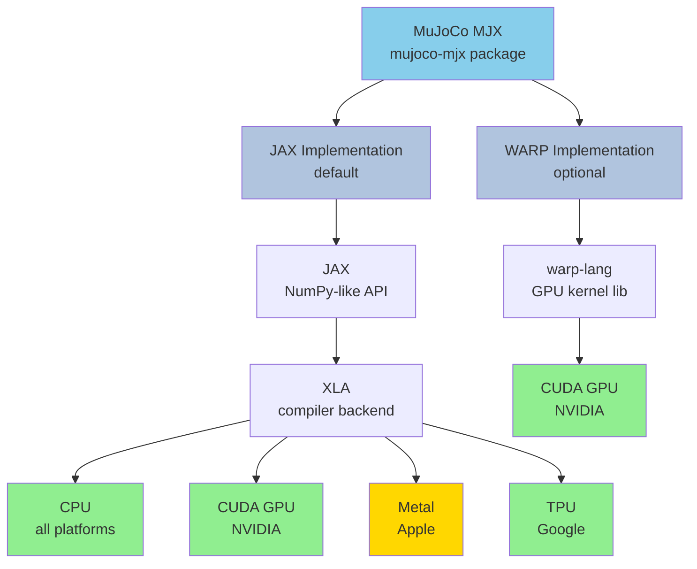
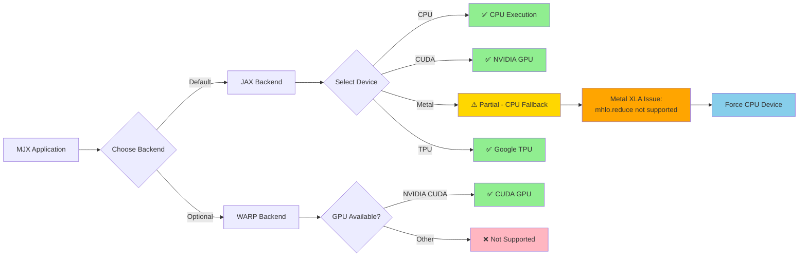

# MJX Architecture: Dependencies and Device Support

This document describes the architecture of MuJoCo MJX (mujoco-mjx), including its component relationships, computational backends, and device support matrix.

## Architecture Overview

MuJoCo MJX is a high-performance physics simulation library that supports multiple computational backends for different hardware platforms. The architecture is designed to provide flexibility in choosing the optimal backend for your specific hardware configuration.

## Component Relationships

### Architecture Diagram



**Legend:**
- 🟢 **Green**: Full support, production ready
- 🟡 **Yellow**: Partial support, has limitations
- 🔵 **Blue**: MJX components
- ⚪ **Light Blue**: Backend implementations

### Device Support Flow



## Backend Implementations

### JAX Implementation (Default)

The JAX implementation is the default backend for MJX and provides broad hardware support through the XLA compiler.

**Key Features:**
- NumPy-like API for ease of use
- Automatic differentiation support
- JIT compilation via XLA
- Cross-platform compatibility

**Dependencies:**
- JAX: Core numerical computing library
- XLA: Optimizing compiler for linear algebra

### WARP Implementation (Optional)

The WARP implementation is an optional backend optimized for GPU workloads using NVIDIA WARP's kernel language.

**Key Features:**
- Direct GPU kernel execution
- Optimized for CUDA devices
- Lower-level control for performance tuning

**Dependencies:**
- warp-lang: GPU kernel library and runtime

Not supported on MACOS.

## Device Support Matrix

| Device Type | JAX Backend | WARP Backend | Support Level |
|-------------|-------------|--------------|---------------|
| CPU (x86_64) | ✅ Full | ❌ N/A | Full |
| CPU (ARM64) | ✅ Full | ❌ N/A | Full |
| NVIDIA GPU (CUDA) | ✅ Full | ✅ Full | Full |
| Google TPU | ✅ Full | ❌ N/A | Full |
| Apple Metal | ⚠️ Partial | ❌ N/A | Partial |

### Device Support Notes

#### CPU Support
- **Full support** on all CPU architectures (x86_64, ARM64)
- JAX backend provides optimized CPU execution
- Suitable for development, testing, and smaller workloads

#### NVIDIA GPU (CUDA)
- **Full support** through both JAX and WARP backends
- CUDA 11.0+ recommended
- Optimal for production workloads and large-scale simulations

#### Google TPU
- **Full support** through JAX backend
- Best for massive parallel simulations
- Cloud TPU v2, v3, v4 supported

#### Apple Metal
- **Partial support** through JAX backend
- Apple Silicon (M1/M2/M3/M4) supported
- Performance may vary compared to CUDA
- Some advanced features may have limitations
- Ongoing development for improved support
- **Current limitation**: MJX physics kernels do not support Metal device
- **Workaround**: Force CPU execution (see Current Benchmarks section below)

## XLA Backend Status

XLA (Accelerated Linear Algebra) is the compiler backend used by JAX to generate optimized code for different hardware platforms.

### XLA Backend Support Matrix


| Backend | Platform | Status | Notes |
|---------|----------|--------|-------|
| **CPU** | All platforms | ✅ **Full** | Complete support, production ready |
| **CUDA** | NVIDIA GPUs | ✅ **Full** | Complete support, optimal performance |
| **TPU** | Google TPUs | ✅ **Full** | Complete support, cloud-only |
| **Metal** | Apple GPUs | ⚠️ **Incomplete** | Missing critical operations |

### Metal XLA Limitation

The Metal XLA backend has incomplete operation support that prevents MJX from running on Apple GPUs:

**Error Details:**
```
Error: failed to legalize operation 'mhlo.reduce'
Location: smooth.py:307 (composite rigid body calculations)
Operation: jp.take(crb_body, jp.array(m.dof_bodyid), axis=0)
```

**Root Cause:**
- The Metal backend lacks legalization for the `mhlo.reduce` operation
- This operation is used extensively in MJX for:
  - Composite rigid body (CRB) calculations
  - Array indexing and gathering operations
  - Physics constraint solving

**Impact:**
- MJX cannot initialize models on Metal device
- Throws `ValueError: Unsupported device: METAL:0`
- Requires CPU fallback for all physics computations

**Tracking:**
- This is a known limitation of the experimental Metal backend
- Apple and Google are actively developing Metal XLA support
- Future JAX/XLA versions may resolve this limitation

## Current Benchmarks

To work around the Metal limitation, we currently run benchmarks on CPU with the following tests:

### 1. Simple Speed Benchmark (`slow_jax.py`)

**Purpose:** Basic kinematics performance test

**Configuration:**
- 9 bodies, 17 geoms, 8 sites
- 3 iterations of kinematics calculations
- JIT compiled with JAX

**Execution:**
```bash
make run_speed
```

**Forces CPU device:**
```python
cpu_device = jax.devices('cpu')[0]
mx = mjx.put_model(m, device=cpu_device)
dx = mjx.put_data(m, d, device=cpu_device)
```

### 2. Official MJX Benchmark (`testspeed.py`)

**Purpose:** Comprehensive physics simulation benchmark

**Configuration:**
- Configurable models (humanoid, pendula, etc.)
- Variable batch sizes (default: 1024)
- Multiple solvers (CG, Newton)
- Full physics stepping with constraints

**Execution:**
```bash
make run_benchmark MODEL=humanoid/humanoid.xml NSTEP=1000 BATCH_SIZE=1024
```

**Forces CPU device:**
```python
os.environ['JAX_PLATFORMS'] = 'cpu'  # Force CPU before JAX import
```

### Benchmark Results on Apple M4 Max (CPU)

**Hardware Configuration:**
- Chip: Apple M4 Max
- Memory: 36 GB
- System Memory: 36.00 GB
- Max Cache Size: 14.04 GB
- JAX Backend: CPU (forced)
- JAX Version: 0.9.1
- MuJoCo Version: 3.6.0
- MuJoCo MJX Version: 3.6.0
- XLA Flags: `xla_cpu_disable_new_fusion_emitters=true` (compatibility workaround)

---

#### Simple Speed Benchmark Results (`slow_jax.py`)

**Test Configuration:**
- Bodies: 9
- Geoms: 17
- Sites: 8
- Iterations: 3
- Operation: Kinematics only

**Results:**
```
Running benchmark with 9 bodies, 17 geoms, 8 sites on METAL
Compiled.
Time for 3 iterations: 0.0010s
Avg time: 0.3327ms
```

**Performance:**
- Total time: 0.0010 seconds
- Average per iteration: 0.3327 milliseconds
- Throughput: ~3,006 iterations/second

---

#### Official MJX Benchmark Results (`testspeed.py`)

##### Test 1: Humanoid Model

**Configuration:**
- Model: `humanoid/humanoid.xml`
- Parallel rollouts: 128
- Steps per rollout: 100
- Timestep (dt): 0.005 seconds
- Solver: Conjugate Gradient (CG)

**Results:**
```
Summary for 128 parallel rollouts

 Total JIT time: 3.34 s
 Total simulation time: 0.11 s
 Total steps per second: 114841
 Total realtime factor: 574.20 x
 Total time per step: 8.71 µs
```

**Performance Analysis:**
- **Compilation overhead**: 3.34 seconds (one-time cost)
- **Simulation time**: 0.11 seconds for 12,800 total steps (128 × 100)
- **Throughput**: 114,841 steps/second
- **Realtime factor**: 574.20x (runs 574x faster than realtime)
- **Latency**: 8.71 microseconds per step
- **Effective simulation rate**: 12,800 steps in 110ms = 116,364 steps/sec

##### Test 2: Pendula Model

**Configuration:**
- Model: `pendula.xml`
- Parallel rollouts: 512
- Steps per rollout: 500
- Timestep (dt): 0.020 seconds
- Solver: Conjugate Gradient (CG)

**Results:**
```
Summary for 512 parallel rollouts

 Total JIT time: 4.62 s
 Total simulation time: 1.72 s
 Total steps per second: 148741
 Total realtime factor: 2974.83 x
 Total time per step: 6.72 µs
```

**Performance Analysis:**
- **Compilation overhead**: 4.62 seconds (one-time cost)
- **Simulation time**: 1.72 seconds for 256,000 total steps (512 × 500)
- **Throughput**: 148,741 steps/second
- **Realtime factor**: 2,974.83x (runs 2,975x faster than realtime)
- **Latency**: 6.72 microseconds per step
- **Effective simulation rate**: 256,000 steps in 1.72s = 148,837 steps/sec

---

#### Performance Comparison

| Model | Batch Size | Steps | Throughput (steps/s) | Realtime Factor | Latency (µs) |
|-------|------------|-------|---------------------|-----------------|--------------|
| **Humanoid** | 128 | 100 | 114,841 | 574.20x | 8.71 |
| **Pendula** | 512 | 500 | 148,741 | 2,974.83x | 6.72 |


**Key Observations:**
- Pendula model achieves ~30% higher throughput due to simpler dynamics
- Both models show excellent parallelization efficiency
- CPU-only performance is competitive for smaller to medium batch sizes
- JIT compilation overhead is amortized across long rollouts

---

**Note:** These are CPU-only results. Once Metal XLA support is complete, GPU acceleration should provide significant performance improvements, potentially 5-10x faster for large batch sizes.

## Choosing a Backend

### When to use JAX Backend:
- Cross-platform compatibility is required
- Targeting CPU, TPU, or Apple Metal devices
- Need automatic differentiation
- Prefer high-level NumPy-like API

### When to use WARP Backend:
- NVIDIA CUDA GPUs are available
- Maximum GPU performance is required
- Need low-level kernel optimization
- Comfortable with GPU programming concepts

## Installation

### JAX Backend (Default)
```bash
pip install mujoco-mjx
pip install jax jaxlib
```

### WARP Backend (Optional)
```bash
pip install mujoco-mjx
pip install warp-lang
```

## Benchmark Considerations

When benchmarking MJX on macOS with Apple Silicon:

1. **Backend Selection**: Use JAX backend (default) as WARP is not supported
2. **Device Limitation**: Must force CPU execution due to Metal XLA incomplete support
3. **XLA Workaround**: Set `XLA_FLAGS="--xla_backend_extra_options=xla_cpu_disable_new_fusion_emitters=true"` for compatibility
4. **Comparison Baseline**: Compare against CPU-only and CUDA implementations
5. **Performance Metrics**: Focus on throughput, latency, and memory usage
6. **Known Limitations**:
   - Metal GPU cannot be used (mhlo.reduce not supported)
   - WARP backend unavailable on macOS
   - CPU-only performance currently achievable

### Running Benchmarks

See [README.md](README.md) for detailed instructions on:
- Setting up the environment
- Running slow_jax.py and testspeed.py benchmarks
- Interpreting results
- Configuring benchmark parameters

## References

- [MuJoCo MJX Documentation](https://mujoco.readthedocs.io/en/stable/mjx.html)
- [JAX Documentation](https://jax.readthedocs.io/)
- [WARP Documentation](https://nvidia.github.io/warp/)
- [XLA Documentation](https://www.tensorflow.org/xla)
