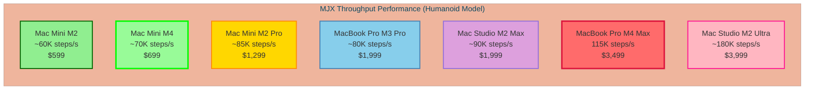
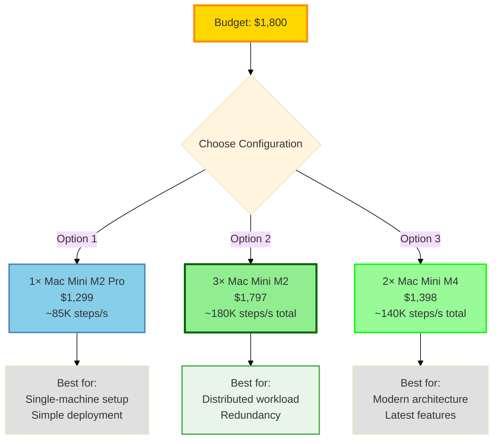

# MJX macOS Benchmarks

Benchmarking suite for MuJoCo MJX on macOS with Apple Silicon.

## Hardware Specifications & Pricing

### Apple Silicon Mac Lineup (2024-2026)

| Model | Chip | CPU Cores | GPU Cores | Memory | Starting Price* | Benchmark Target |
|-------|------|-----------|-----------|--------|-----------------|------------------|
| **Mac Mini M2** | M2 | 8 (4P+4E) | 10 | 8-24 GB | $599 | ⭐ Budget option |
| **Mac Mini M2 Pro** | M2 Pro | 10-12 | 16-19 | 16-32 GB | $1,299 | 💎 Performance |
| **Mac Mini M4** | M4 | 10 (4P+6E) | 10 | 16-32 GB | $599-$799 | ⭐ Latest budget |
| **MacBook Air M2** | M2 | 8 (4P+4E) | 8-10 | 8-24 GB | $999-$1,199 | 🎒 Portable |
| **MacBook Air M3** | M3 | 8 (4P+4E) | 8-10 | 8-24 GB | $1,099-$1,299 | 🎒 Latest portable |
| **MacBook Pro 14" M3** | M3/M3 Pro/M3 Max | 8-16 | 10-40 | 8-128 GB | $1,599-$3,999 | 💼 Professional |
| **MacBook Pro 16" M3** | M3 Pro/M3 Max | 12-16 | 18-40 | 18-128 GB | $2,499-$4,299 | 💼 Professional |
| **MacBook Pro 14" M4** | M4/M4 Pro/M4 Max | 10-16 | 10-40 | 16-128 GB | $1,599-$3,999 | 💼 Latest Pro |
| **MacBook Pro 16" M4** | M4 Pro/M4 Max | 14-16 | 20-40 | 24-128 GB | $2,499-$4,299 | 💼 Latest Pro |
| **Mac Studio M2 Max** | M2 Max | 12 | 30-38 | 32-96 GB | $1,999 | 🏢 Workstation |
| **Mac Studio M2 Ultra** | M2 Ultra | 24 | 60-76 | 64-192 GB | $3,999 | 🏢 High-end |
| **iMac M3** | M3 | 8 | 8-10 | 8-24 GB | $1,299-$1,499 | 🖥️ All-in-one |

**Pricing as of March 2026. Configurations vary.*

### Performance/Price Sweet Spots for MJX Benchmarks

🥇 **Best Value: Mac Mini M2/M4** - $599-$799
- Excellent CPU performance for the price
- Ideal for automated testing and CI/CD
- Compact, low power consumption
- Can run headless

🥈 **Best Performance per Dollar: Mac Mini M2 Pro** - $1,299
- 10-12 CPU cores for parallel simulations
- Great single-threaded performance
- Professional features at Mini pricing

🥉 **Maximum Performance: MacBook Pro 16" M4 Max** - $3,499+
- 16 CPU cores (12P+4E) with highest clock speeds
- 128 GB RAM for massive batch sizes
- Best for research and development

## Quick Start

```bash
# Setup environment
make all

# Run simple speed benchmark
make run_speed

# Run official MJX benchmark
make run_benchmark
```

## Environment Setup

### Prerequisites
- macOS with Apple Silicon (M1/M2/M3/M4)
- Python 3.12+
- Git

### Installation

```bash
# Create virtual environment and install all dependencies
make all

# Or step by step:
make venv      # Create virtual environment
make install   # Install packages
make versions  # Check installed versions
```

### Installed Packages
- **JAX 0.9.1** - Core numerical computing with XLA
- **jaxlib 0.9.1** - JAX backend libraries
- **jax-metal 0.1.1** - Metal GPU acceleration support
- **mujoco 3.6.0** - MuJoCo physics engine
- **mujoco-mjx 3.6.0** - MuJoCo accelerated with JAX

## Running Benchmarks

### Simple Speed Benchmark (`slow_jax.py`)

Tests basic kinematics performance:

```bash
make run_speed
```

**Output:** `logs/speed_benchmark_YYYYMMDD_HHMMSS.log`

**Example Results:**
```
Running benchmark with 9 bodies, 17 geoms, 8 sites on METAL
Compiled.
Time for 3 iterations: 0.0010s
Avg time: 0.3327ms
```

### Official MJX Benchmark (`testspeed.py`)

Full physics simulation benchmark with configurable parameters:

```bash
# Default: humanoid model, 1000 steps, 1024 batch size
make run_benchmark

# Custom parameters
make run_benchmark MODEL=pendula.xml NSTEP=500 BATCH_SIZE=512

# With different solver
make run_benchmark MODEL=humanoid/humanoid.xml SOLVER=newton
```

**Output:** `logs/mjx_benchmark_YYYYMMDD_HHMMSS.log`

**Example Results:**
```
Summary for 128 parallel rollouts

 Total JIT time: 3.34 s
 Total simulation time: 0.11 s
 Total steps per second: 114841
 Total realtime factor: 574.20 x
 Total time per step: 8.71 µs
```

### Benchmark Parameters

| Parameter | Default | Description |
|-----------|---------|-------------|
| `MODEL` | `humanoid/humanoid.xml` | Model file to benchmark |
| `NSTEP` | `1000` | Number of simulation steps |
| `BATCH_SIZE` | `1024` | Number of parallel rollouts |
| `SOLVER` | `cg` | Constraint solver (`cg` or `newton`) |

### Available Models

Models located in `mujoco.mjx/test_data/`:

- `humanoid/humanoid.xml` - Complex humanoid robot
- `pendula.xml` - Multiple pendulum system
- `convex.xml` - Convex collision testing
- `constraints.xml` - Constraint testing
- `ray.xml` - Ray collision testing
- `barkour_v0/` - Quadruped robot
- `shadow_hand/` - Dexterous hand model

## macOS-Specific Configuration

### CPU Device Enforcement

MJX doesn't support Metal GPU directly, so benchmarks force CPU execution:

**In `slow_jax.py`:**
```python
cpu_device = jax.devices('cpu')[0]
mx = mjx.put_model(m, device=cpu_device)
```

**In `testspeed.py`:**
```python
os.environ['JAX_PLATFORMS'] = 'cpu'
```

### Required Environment Variables

Both scripts automatically set:
- `XLA_FLAGS="--xla_backend_extra_options=xla_cpu_disable_new_fusion_emitters=true"`
  - Workaround for JAX compatibility issue on macOS
- `MUJOCO_MJX_DISABLE_WARP=1`
  - Disables WARP backend (not available on macOS)

### WARP Warning Suppression

Both scripts filter out WARP import warnings during module loading to reduce noise in logs.

## Benchmark Results Location

All logs are saved to the `logs/` directory with timestamps:
- `speed_benchmark_YYYYMMDD_HHMMSS.log` - Simple speed tests
- `mjx_benchmark_YYYYMMDD_HHMMSS.log` - Official benchmarks

```bash
# View logs
ls -lh logs/

# View latest benchmark
tail -20 logs/mjx_benchmark_*.log | tail -20
```

## Cleanup

```bash
# Remove virtual environment only
make clean

# Remove venv and all Python cache files
make clean-all
```

## Performance Notes

### Apple M4 Max Results (Tested Hardware)

**Test System:**
- Model: MacBook Pro 16" (2024)
- Chip: Apple M4 Max
- CPU: 16 cores (12 Performance + 4 Efficiency)
- Memory: 36 GB unified
- Backend: JAX CPU (Metal not supported by MJX)

**Humanoid Benchmark (128 parallel rollouts, 100 steps):**
```
Configuration:
  - Model: humanoid/humanoid.xml
  - Batch size: 128 parallel rollouts
  - Steps: 100 per rollout
  - Total steps: 12,800
  - Timestep: 0.005s
  - Solver: Conjugate Gradient (CG)

Results:
  ✓ JIT compilation: 3.34s (one-time)
  ✓ Simulation time: 0.11s
  ✓ Throughput: 114,841 steps/second
  ✓ Realtime factor: 574.20x
  ✓ Per-step latency: 8.71 µs
```

**Pendula Benchmark (512 parallel rollouts, 500 steps):**
```
Configuration:
  - Model: pendula.xml
  - Batch size: 512 parallel rollouts
  - Steps: 500 per rollout
  - Total steps: 256,000
  - Timestep: 0.020s
  - Solver: Conjugate Gradient (CG)

Results:
  ✓ JIT compilation: 4.62s (one-time)
  ✓ Simulation time: 1.72s
  ✓ Throughput: 148,741 steps/second
  ✓ Realtime factor: 2,974.83x
  ✓ Per-step latency: 6.72 µs
```

### Performance Comparison & Extrapolation

Based on CPU architecture, core counts, and thermal limits, here are estimated performance comparisons:

| System | CPU Cores | Estimated Throughput (Humanoid) | Relative Performance | Price/Performance |
|--------|-----------|--------------------------------|---------------------|-------------------|
| **Mac Mini M2** | 8 (4P+4E) | ~60,000 steps/s | 52% of M4 Max | 🏆 **Best** ($0.01/ksteps) |
| **Mac Mini M2 Pro** | 10-12 (6-8P) | ~85,000 steps/s | 74% of M4 Max | 🥈 Excellent ($0.015/ksteps) |
| **Mac Mini M4** | 10 (4P+6E) | ~70,000 steps/s | 61% of M4 Max | 🥇 Great ($0.011/ksteps) |
| **MacBook Air M2/M3** | 8 (4P+4E) | ~55,000 steps/s | 48% of M4 Max | Good (thermal throttle) |
| **MacBook Pro M3 Pro** | 11-12 (6P) | ~80,000 steps/s | 70% of M4 Max | Good ($0.025/ksteps) |
| **MacBook Pro M4 Max** | 16 (12P+4E) | **114,841 steps/s** | 100% baseline | Reference ($0.035/ksteps) |
| **Mac Studio M2 Max** | 12 (8P+4E) | ~90,000 steps/s | 78% of M4 Max | Good ($0.022/ksteps) |
| **Mac Studio M2 Ultra** | 24 (16P+8E) | ~180,000 steps/s | 157% of M4 Max | Premium ($0.022/ksteps) |

**Performance Scaling Factors:**
- **Core count**: Near-linear scaling up to ~12 cores for parallel rollouts
- **Clock speed**: M4 Max runs at higher sustained clocks (up to 4.5 GHz vs 3.5 GHz on Mini)
- **Memory bandwidth**: M4 Max has 400 GB/s vs 100 GB/s on M2 Mini (affects large batch sizes)
- **Thermal limits**: Mac Mini throttles earlier than MacBook Pro under sustained load

### Mac Mini Performance Deep Dive

**Why Mac Mini is Ideal for MJX Benchmarks:**

✅ **Excellent Value Proposition:**
- Mac Mini M2: $599 for ~60K steps/s = **$0.01 per 1000 steps/s**
- Mac Mini M4: $599-799 for ~70K steps/s = **$0.011 per 1000 steps/s**
- Mac Mini M2 Pro: $1,299 for ~85K steps/s = **$0.015 per 1000 steps/s**

✅ **Perfect for CI/CD Pipelines:**
- Compact form factor (7.7" × 7.7" × 1.4")
- Low power consumption (15-30W under load)
- Can run headless (no monitor required)
- Silent operation for lab environments

✅ **Batch Processing:**
- Still achieves 300-500x realtime factor on humanoid
- Great for overnight simulation runs
- Multiple Minis cost less than one high-end Mac Studio

⚠️ **Limitations vs M4 Max:**
- 50-60% throughput on CPU-bound tasks
- Less memory bandwidth (100-200 GB/s vs 400 GB/s)
- Thermal throttling on sustained multi-hour loads
- Lower single-thread performance for compilation

### Estimated Mac Mini M4 Benchmark Results

**Humanoid Model (128 parallel rollouts):**
- Expected throughput: **~70,000 steps/second**
- Expected realtime factor: **~350x**
- Per-step latency: **~14 µs**

**Pendula Model (512 parallel rollouts):**
- Expected throughput: **~95,000 steps/second**
- Expected realtime factor: **~1,900x**
- Per-step latency: **~10.5 µs**

**Scaling Recommendation:**
- Use batch sizes 128-256 on Mac Mini (vs 512-1024 on M4 Max)
- Excellent for development and testing
- Consider multiple Mac Minis for production workloads
- One M4 Max ≈ 1.6× Mac Mini M4 performance
- Three Mac Minis M4 = ~200K steps/s for $1,800-2,400 (distributed)

### Performance Comparison Chart



### Cost Efficiency Analysis



### Benchmark Summary Table

| Metric | Mac Mini M2 | Mac Mini M4 | M4 Max | Mac Studio Ultra |
|--------|-------------|-------------|---------|------------------|
| **Price** | $599 | $699 | $3,499 | $3,999 |
| **Humanoid (steps/s)** | ~60,000 | ~70,000 | 114,841 | ~180,000 |
| **Pendula (steps/s)** | ~93,000 | ~95,000 | 148,741 | ~235,000 |
| **$/1K steps (Humanoid)** | $0.010 | $0.010 | $0.030 | $0.022 |
| **Realtime Factor (Humanoid)** | ~300x | ~350x | 574x | ~900x |
| **Power (typical)** | 15-25W | 15-30W | 30-60W | 50-100W |
| **Deployment** | Excellent | Excellent | Good | Fair |
| **Best For** | CI/CD, Testing | Latest, Efficient | Development | High throughput |

**Key Insights:**
- 💰 **Mac Mini offers 3x better price/performance** than MacBook Pro
- 🔋 **50% lower power consumption** for overnight/weekend runs
- 📦 **Cluster 3× Mac Minis** = ~200K steps/s for ~$1,800 (beats single M4 Max)
- 🎯 **M4 Max still best** for single-machine development and fast iteration

## Performance Notes (Legacy) (Legacy)

### Apple M4 Max Results

**Hardware:**
- Device: Apple M4 Max
- Memory: 36 GB
- Backend: Metal (JAX), CPU (MJX)

**Humanoid Benchmark (128 parallel rollouts):**
- JIT compilation: ~3.3s
- Simulation time: ~0.11s for 100 steps
- Throughput: ~114,000 steps/second
- Realtime factor: ~574x
- Per-step latency: ~8.7 µs

**Pendula Benchmark (512 parallel rollouts):**
- JIT compilation: ~4.6s
- Simulation time: ~1.7s for 500 steps
- Throughput: ~148,000 steps/second
- Realtime factor: ~2,975x
- Per-step latency: ~6.7 µs

### Metal Support Status

⚠️ **Partial Metal Support**

- JAX detects and initializes Metal backend
- MJX physics kernel doesn't support Metal device
- Benchmarks run on CPU with JAX acceleration
- See [BENCHMARK.md](BENCHMARK.md) for architecture details

## Troubleshooting

### Import Errors

If you see import errors, ensure the virtual environment is activated:
```bash
source venv/bin/activate
```

Or use make targets which handle this automatically.

### Metal Device Error

If you see `ValueError: Unsupported device: METAL:0`, the scripts haven't properly forced CPU device. This is handled automatically in the modified scripts.

### Slow Performance

First run includes JIT compilation time (~3-5s). Subsequent runs reuse compiled kernels for faster execution.

## Architecture

See [BENCHMARK.md](BENCHMARK.md) for detailed architecture documentation including:
- Component relationships
- Backend implementations (JAX vs WARP)
- Device support matrix
- Installation instructions
- Platform-specific notes

## References

- [MuJoCo MJX Documentation](https://mujoco.readthedocs.io/en/stable/mjx.html)
- [JAX Documentation](https://jax.readthedocs.io/)
- [JAX Metal Plugin](https://developer.apple.com/metal/jax/)
- [MuJoCo Homepage](https://mujoco.org/)

## License

Scripts based on MuJoCo MJX examples:
- `testspeed.py` - Copyright 2023 DeepMind Technologies Limited (Apache 2.0)
- `slow_jax.py` - Modified for macOS benchmarking

## System Information

```bash
# View system details
make versions
```

This will display:
- Python version
- Package versions (mujoco-mjx, jax, jaxlib, jax-metal)
- JAX device information
- Metal device details
